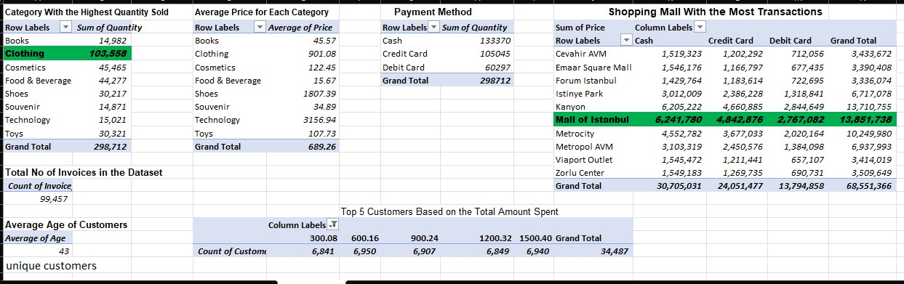

# FEAR-NOT-COMPANY
## Documentation 
## Project outline
Can you provide an example scenario where SQL would be beneficial?
How does SQL contribute to data integrity in a relational database?
Give an example of two tables in a relational database and explain a potential relationship between them.
Briefly explain the role of Database management system in the context of SQL

## Tools Used
* MS word
* Ms Excel _**[download here](https.microsoft.com)**__
* Google sheet
  ---
  ## Data Source

```
Heading 1    Heading 2    Heading 3
Data  1      Data 2        Data 3

```
## Google Sheet
Select * from table 1

Where  conditional = Net 


